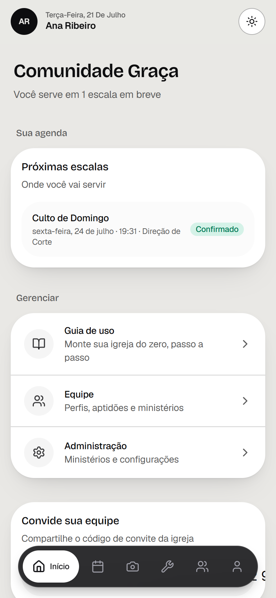
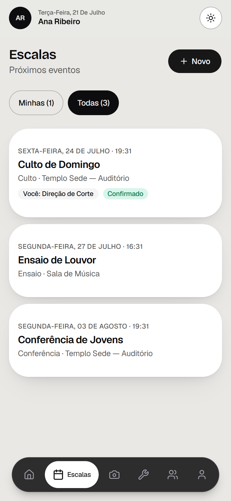

<h1 align="center">Acts</h1>

<p align="center">
  <strong>Free, open-source church management software</strong> — scheduling, media &amp; worship teams,
  volunteers, equipment and ministries. Mobile-first (PWA).<br>
  <em>Gestão de igreja gratuita e open-source — escalas, equipe de mídia, voluntários e ministérios.</em>
</p>

<p align="center">
  <a href="LICENSE"></a>
  
  
  
  
</p>

<p align="center">
  <strong>English</strong> · <a href="#-português">Português 🇧🇷</a>
</p>

<p align="center">
  
</p>

<p align="center">
  
  
  
</p>
<p align="center">
  
  
  
</p>
<p align="center"><sub>Real in-app screenshots · Telas reais do app — mobile-first PWA</sub></p>

---

## What is Acts

Churches coordinate dozens of volunteers across WhatsApp groups and spreadsheets — and
people forget their slot, leaders have no view of who confirmed, and the same few
always get overloaded. **Acts** puts all of that in one place, **mobile-first**, with a
single obsession: **helping the volunteer show up**.

It was born managing a **media/production team** and grows toward the whole church —
each ministry as a branch of the same system.

> **Keywords:** church management software · church management system (ChMS) · church CRM ·
> volunteer scheduling · church scheduling software · worship team · media/production team ·
> ministry management · service planning · rota · open-source church software ·
> free church software · PWA · Next.js · Supabase · multi-tenant · RLS.

## Features

- **Scheduling & events** — build the service rota, assign people to roles, attach
  equipment, and see who **confirmed / pending / requested a swap** at a glance.
- **One-tap confirmation** — from the home screen, or by adding the schedule to the
  phone's native **calendar** (`.ics`).
- **Assisted scheduling** — when assigning, the leader sees each person's **monthly
  load**, whether they're **unavailable** on that date, their **skills** and their
  **interests** — an informed decision that stops overloading the same volunteers.
- **Availability** — volunteers flag when they can't serve, *before* the rota exists.
- **Skills, interests & training** — the system cross-references *who wants* to serve
  in an area with *who is already able*, producing a **"who wants to grow"** queue.
- **Assets / equipment** — inventory, usage history, maintenance and tickets.
- **People & ministries** — profiles, roles, skills and departments.
- **Post-service reviews** — structured feedback by criteria.
- **Multi-church (multi-tenant)** — per-church isolation enforced by Row Level Security.
- **PWA** — installs to the home screen, works like a native app on the phone.

## Roles

Two levels, like a real church:

- **Church:** Admin · Coordinator · Member
- **Ministry:** Manager · Leader · Instructor · Volunteer
- **Platform:** Super-admin (operates across every church)

## Stack

| Layer | Technology |
|---|---|
| Frontend | Next.js (App Router, React Server Components), TypeScript, Tailwind, Base UI |
| Backend | Supabase (Postgres + **RLS** + Auth + Storage) |
| Deploy | Cloudflare Workers via OpenNext |
| App | PWA (installable, mobile-first) |

Data security is enforced by **Row Level Security** in Postgres: each church only ever
sees its own data — guaranteed at the database, not just the application. A test suite
covers cross-church isolation.

## Getting started

Requirements: Node 20+, Docker (for local Supabase), the Supabase CLI.

```bash
npm install
cp .env.example .env.local      # fill in your Supabase URL and ANON KEY
npx supabase start              # spins up local Postgres/Auth/Storage
npx supabase db reset           # applies the migrations
npm run dev                     # http://localhost:3000
npm test                        # RLS + unit tests (needs local Supabase)
```

Migrations live in `supabase/migrations/`. **Before using**, adjust the super-admin
allowlist in `00000000000006_super_admin.sql` (it ships with example e-mails — replace
them with your own).

## Philosophy

Acts is **free for any church, anywhere**. The idea is that whoever can contribute
helps sustain the infrastructure — and, in a **solidarity model**, keeps the smaller
churches free forever. Acts is an **aggregator**, not a clone: it centralizes management
and aims to **talk to** the tools a church already uses (like Holyrics via its open API),
instead of rebuilding them. **API-first**: every feature is designed to expose a public
endpoint, so the aggregator grows organically.

## Contributing

Contributions are welcome — issues, ideas and PRs. The system is designed to grow by
modules (each ministry is a branch). See [`LICENSE`](LICENSE) (MIT).

---

## 🇧🇷 Português

**Acts** é um **software de gestão de igreja gratuito e open-source** (CRM de igreja):
escalas de culto, equipe de mídia, voluntários, patrimônio e ministérios — **mobile-first**
(PWA). Nasceu na gestão da **equipe de mídia** e cresce para a igreja inteira, cada
ministério como uma ramificação.

Igrejas coordenam dezenas de voluntários no WhatsApp e em planilhas — e o resultado é
gente que esquece a escala, líderes sem visão de quem confirmou, e os mesmos poucos
sempre sobrecarregados. O Acts organiza tudo num só lugar, com foco em **fazer o
voluntário aparecer**.

> **Palavras-chave:** gestão de igreja · CRM igreja · software para igreja · escala de
> culto · equipe de mídia · organização de voluntários · ministério · louvor · sistema
> de escalas · igreja evangélica · gestão de equipe · multi-tenant · PWA.

### Funcionalidades

- **Escalas & eventos** — monte a escala do culto, escale pessoas por função, vincule
  equipamentos, e veja quem **confirmou / falta confirmar / pediu troca** num olhar.
- **Confirmação em um toque** — pela Home ou adicionando a escala ao **calendário do
  celular** (`.ics`).
- **Escalação assistida** — ao escalar, o líder vê a **carga do mês** de cada pessoa, se
  está **indisponível**, suas **aptidões** e **interesses** — sem sobrecarregar sempre os
  mesmos.
- **Indisponibilidade** — o voluntário avisa quando não pode servir, antes da escala existir.
- **Aptidões, interesses e treinamento** — cruza *quem quer* servir com *quem já é apto*,
  gerando a fila de **"quem quer crescer"**.
- **Patrimônio / equipamentos** — inventário, histórico, manutenções e chamados.
- **Pessoas & ministérios**, **avaliações pós-culto**, **multi-igreja** (isolamento por RLS),
  e **PWA** (instala na tela inicial).

### Papéis

- **Igreja:** Administrador · Coordenador · Membro
- **Ministério:** Gerente · Líder · Instrutor · Voluntário
- **Plataforma:** Super-admin (opera em todas as igrejas)

### Rodando localmente

```bash
npm install
cp .env.example .env.local      # preencha URL e ANON KEY do Supabase
npx supabase start              # sobe o Postgres/Auth/Storage local
npx supabase db reset           # aplica as migrations
npm run dev                     # http://localhost:3000
npm test                        # testes de RLS + unitários (precisa do Supabase local)
```

As migrations ficam em `supabase/migrations/`. **Antes de usar**, ajuste a allowlist de
super-admins em `00000000000006_super_admin.sql` (há e-mails de exemplo — troque pelos seus).

### Filosofia

Acts é **free para qualquer igreja**. Quem puder contribuir ajuda a sustentar a estrutura
e, num **modelo solidário**, mantém as igrejas menores sempre gratuitas. É um **agregador**,
não um clone: centraliza a gestão e pretende **conversar** com as ferramentas que a igreja
já usa (como o Holyrics, pela API aberta), sem refazê-las. **API-first**: cada feature nasce
com endpoint público.

## Licença / License

MIT — veja [LICENSE](LICENSE).
